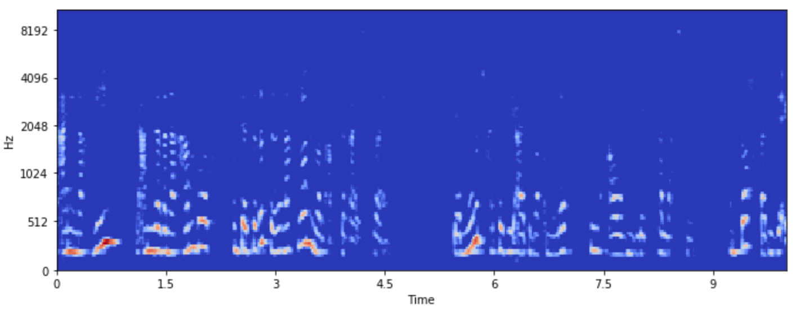

# Speech-Language-Identification-DRDO-Librosa

The project is a part of my internship and the research project at the Defence Research and Development Organisation - Scientific Analysis Group where I have to classify the speech audio samples in various languages spoken in India. The project will involve various techniques involving certain techniques to analyse the waveform, reduce the noise and use Machine Learning techniques to classify the audio clip.

## Techniques used to analyse the model

### Convolutional Neural Network (CNN)
The method involves using Spectogram to analyse the spacial temporal data of the sound sample with the help of Librosa to generate images of the Spectogram graph and saving them. CNNs were used after the graphs were generated in the form of the images to study the patterns to classify the languages in the following categories.
<ul>
<li> English
<li> German
<li> Spanish
</ul>

#### Spectrogram from the Speech

#### Prediction from a sample audio clip

### Long Short Term Memory (RNN)
Recurrent networks can be used to study the sequential data of the speech samples and I yet have to try them

### Frameworks
<ul>
<li> Pytorch
<li> Pytorchvision
<li> Librosa
<li> Numpy
<li> Pandas
</ul>

### Resources
<ul>
<li> <a href = "https://www.kaggle.com/toponowicz/spoken-language-identification/downloads/spoken-language-identification.zip/1"> Kaggle dataset for Spoken Language Identification</a>
<li> <a href = "https://librosa.github.io/librosa/generated/librosa.feature.melspectrogram.html">Generating Spectrogram using Librosa</a>
<li> <a href = "https://arxiv.org/pdf/1812.00149.pdf">Using CNNs for audio classification</a>
</ul>

